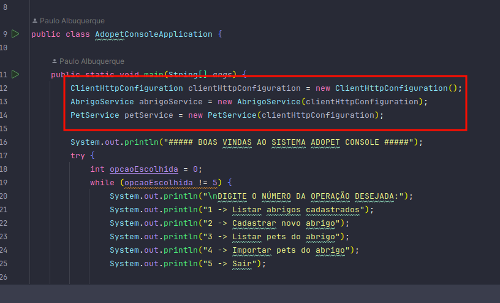
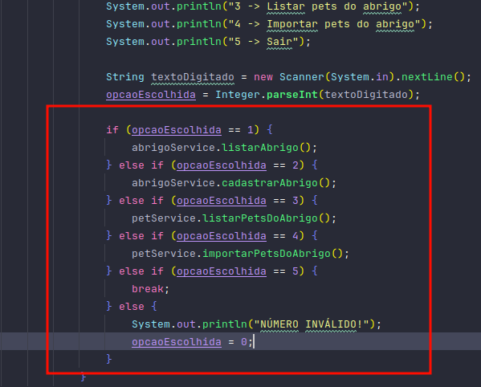
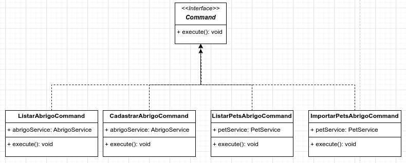

# Melhorias
## Forte acoplamento:

### Caracteristica
Instanciacao de muitas classes na main.
### Exemplo de problema
Caso seja necessario acrescentar parametros no construtor de AbrigoService, precisa ajustar a chamada na main e em todo lugar que estiver instanciando.

## Acumulo de responsabilidade. Nao extensivel. Duplicacao

### Caracterisrica
O metodo toma decisao de acao e chama a execucao. Cada opcao nova que surgir, fara este metodo crescer.
### Exemplo de problema
Codigo fica mais complexo de se manter. Mexer em uma das acoes pode potencialmente impactar no fluxo de outras, ja que tudo esta sendo gerenciado em um local apenas.

## Solucao
### Command
Cada acao contida nos if's representarao um Command. Cada command possui um metodo *execute*, que cuida de chamar a acao que lhe diz respeito. 

Uma classe de invocacao do Command vai ser responsavel por chamar o metodo *execute* de um Command passado como parametro.